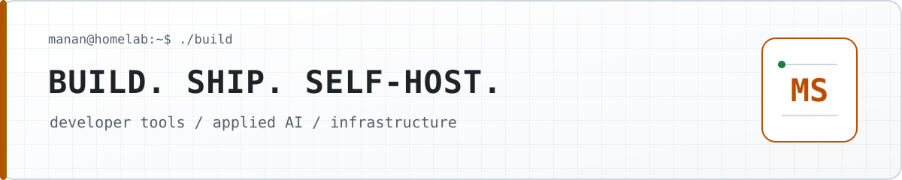

<picture>
  <source media="(prefers-color-scheme: dark)" srcset="./assets/profile-banner-dark.svg">
  <source media="(prefers-color-scheme: light)" srcset="./assets/profile-banner-light.svg">
  
</picture>

# Manan Santoki

**I build open-source tools, applied AI systems, and infrastructure I can run myself.**

MS Computer Science @ Arizona State University · Tempe, Arizona

[Website](https://msantoki.com) · [LinkedIn](https://www.linkedin.com/in/manan-santoki) · [Email](mailto:manansantoki2003@gmail.com)

---

### Now shipping

<!-- profile-now:start -->
[**Firecrawl Community**](https://github.com/Manan-Santoki/firecrawl) `updated Sep 2` · [**Backslash**](https://github.com/Manan-Santoki/Backslash) `v0.1.0` · [**browserpilot**](https://github.com/Manan-Santoki/browserpilot) `v1.0.0`
<!-- profile-now:end -->

### Selected work

- [**Backslash**](https://github.com/Manan-Santoki/Backslash) — Self-hostable LaTeX editor with live PDF preview and a full REST API.
- [**Binderly**](https://github.com/Manan-Santoki/Binderly) — Open-source Markdown workbench with Mermaid diagrams and page-perfect PDF export.
- [**Firecrawl Community**](https://github.com/Manan-Santoki/firecrawl) — Keeping current Firecrawl releases practical to self-host.
- [**GitHub Orbit**](https://github.com/Manan-Santoki/github-orbit) — Self-hosted GitHub graph and explainable people recommendations.

### Current focus

`TypeScript` · `React` · `Next.js` · `Node.js` · `Python` · `PostgreSQL` · `Docker` · `Dokploy`

Developer tools, reliable agent workflows, browser automation, and self-hosted infrastructure.
